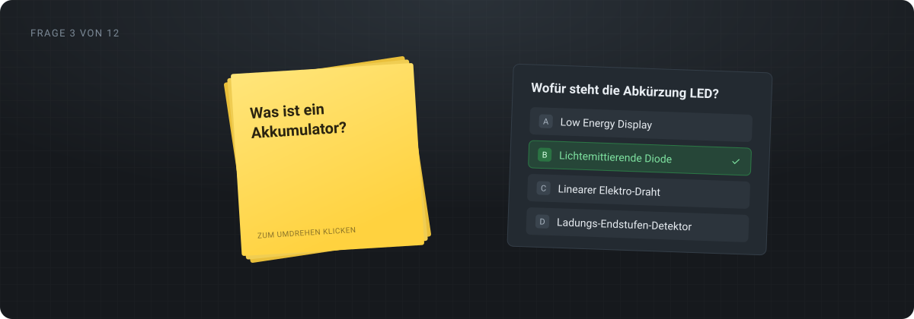

<div align="center">



# Flashcards for vocational school

**Flashcards and quiz questions as a learning page on the web.**
The teacher hands their AI agent a worksheet and gets back a link. The class
opens it and gets going – no account, no app, and no result stored
anywhere.

[](https://github.com/straussbastian/ai_flashcards_for_school/actions/workflows/tests.yml)

**English** · [Deutsch](README.de.md)

</div>

> **A note on language.** This README is English, but the application itself
> is German throughout: the learning pages, the MCP tool names, the
> three-word addresses. It was built for a German vocational school, and it
> stays that way.

---

## What this looks like day to day

The teacher tells their agent:

> "Turn this worksheet into a learning bundle for me."

The agent creates it and answers with a three-word address:

```
https://cards.your-school.example/blaue-katze-springt
```

That link goes to the class – in the class chat, as a QR code on the wall,
printed on the worksheet. Whoever opens it sees a start button and then one
card after another: cards are clicked to flip them over, quiz questions are
answered with A/B/C/D, by mouse or keyboard. A wrong answer means the right
one is shown straight away. At the end the score is on screen, and one
button sets everything back to zero.

## What the learning pages deliberately do not do

| | |
|---|---|
| **No sign-in** | Whoever has the link can learn. No account, no password, no class list. |
| **No results** | The score sits on the screen at the end and is gone afterwards. It is stored nowhere and transmitted nowhere. |
| **No cookies, no tracking pixels** | The progress of a run lives in the browser for as long as the run lasts. |
| **No admin interface** | There is no admin area anyone could log into – content only ever arrives through the AI agent. |
| **No permanent deletion** | A learning bundle can be made invisible, but not thrown away by accident. |

## Further reading

| Document | What it covers |
|---|---|
| **[Technical description](docs/technische-beschreibung.md)** (German) | Purpose, structure, operation, security, running it and its limits on one page – without a line of code. Written for colleagues, school management and data protection officers. The same page, typeset for passing on: [technische-beschreibung.html](docs/technische-beschreibung.html) |
| **[Architecture diagram](docs/architektur.html)** (German) | The setup as a clickable diagram: which path leads where, and everything that sits behind the one published port |
| [docs/betrieb-server.md](docs/betrieb-server.md) (German) | Running it on a server of your own, step by step |
| [docs/praxistest-cowork.md](docs/praxistest-cowork.md) (German) | Connecting the MCP server to Claude Cowork |

GitHub renders the Markdown versions directly. The two HTML pages are
self-contained files for the browser – after cloning, a double click is
enough; on github.com the link only leads to the source, though, because
GitHub does not render HTML out of a repository.

## Running it yourself – which way is mine?

| I would like to … | Way | Effort |
|---|---|---|
| just have a look at it | [On my own machine](#look-at-it-on-your-own-machine) | 5 minutes, Docker is enough |
| use it with my classes | **[On a server of my own](docs/betrieb-server.md)** (German) | ~30 minutes once, from €4 a month |
| contribute to it | [For developers](#for-developers) | Docker, nothing else |

### Look at it on your own machine

All you need is Docker – no Python, no PostgreSQL, nothing else.

```bash
git clone https://github.com/straussbastian/ai_flashcards_for_school.git
cd ai_flashcards_for_school
cp .env.example .env       # fill in the values, see the comments inside
docker compose up -d --build
```

`compose.yml` deliberately publishes no port: the application is reachable
only from within the Docker network, exactly as it will be later on the
server behind the reverse proxy. To take a look in the browser you therefore
need one addition next to it – Docker Compose picks it up by itself, and
`.gitignore` keeps it out of the repository:

```bash
cat > compose.override.yml <<'EOF'
services:
  app:
    ports:
      # 127.0.0.1: reachable from this machine only, from outside only
      # through a tunnel you started on purpose.
      - "127.0.0.1:8000:8000"
EOF

docker compose up -d
```

The application is then at `http://localhost:8000`. To check:

```bash
curl -s http://localhost:8000/healthz
# {"status":"ok","datenbank":"ok"}
```

Follow the logs with `docker compose logs -f`, stop with
`docker compose down`. Everything is still there on the next start – unless
you append a `-v`, see below.

### On a server of your own

The full guide is in **[docs/betrieb-server.md](docs/betrieb-server.md)**
(German). In short it comes down to this:

```bash
curl -O https://raw.githubusercontent.com/straussbastian/ai_flashcards_for_school/main/compose.server.yml
# put a .env with four values next to it
docker compose -f compose.server.yml up -d
```

`compose.server.yml` pulls the finished image from the GitHub registry,
starts PostgreSQL alongside it and puts a Caddy in front that fetches its
certificate from Let's Encrypt on its own. Nothing is built and nothing is
set up on the server; the repository does not even need to be there.

## Maintaining the content

There is deliberately **no administration interface**. The learning pages
are maintained exclusively through the MCP server at `POST /mcp`, operated
by an AI agent – secured with OAuth 2.1 and the `TEACHER_PASSWORD`.

The tool names are German, because the agent is spoken to in German:

| Tool | What for |
|---|---|
| `bundle_anlegen` | A new learning bundle including its cards, in one call |
| `bundle_liste` | What is there? Active ones by default; `nur_aktive=false` shows the retired ones too |
| `bundle_anzeigen` | One bundle with all its cards |
| `bundle_aendern` | Title, description, group – the link stays the same |
| `karten_hinzufuegen` | More cards for an existing bundle |
| `karte_aendern` | Correct a single card |
| `karte_loeschen` | Remove a single card |
| `bundle_deaktivieren` | Make the bundle invisible without throwing anything away |

A collection ("Sammlung") bundles several learning packs under one address,
so the class gets **one** link instead of many:

| Tool | What for |
|---|---|
| `sammlung_anlegen` | A new collection under its own three-word address |
| `sammlung_liste` | The collections with address, link, title, group and pack count |
| `sammlung_anzeigen` | One collection with its packs, in their order |
| `sammlung_aendern` | Title, description, group – the link stays the same |
| `sammlung_pakete_setzen` | The list handed in **replaces** the previous one completely, in the given order |
| `sammlung_deaktivieren` | Make the collection invisible; the packs in it stay reachable individually |

Permanently deleting a bundle is deliberately not on offer here.

A few capabilities are not obvious from the tool names:

- **Sampling** – a bundle can ask only part of its cards per run, drawn at
  random: ten out of forty, different ones every time.
- **Order** – the cards come shuffled on every run, or always in the same
  sequence. The answers of a quiz question are reshuffled every time
  regardless.
- **Self-assessment** – the back of a flashcard carries "Wusste ich" and
  "Wusste ich nicht" ("I knew it" / "I didn't"), and that counts towards the
  score. Switched off, only the quiz questions count.
- **Inserting at a position** – new cards go to the end or into the middle,
  as you like.
- **Groups** – "WBA3" or "Englisch", a class or a subject; the listings can
  be filtered by it.

What exactly a tool expects is written in its own description inside the MCP
server. The agent reads it; the teacher does not have to know it.

How to connect the server to Claude Cowork is described in
[docs/praxistest-cowork.md](docs/praxistest-cowork.md) (German).

## The one thing to back up: the volume

The learning bundles live in the volume **`pgdata`**, mounted at
`/var/lib/postgresql/data` in the `db` service. Whoever backs up that volume
has everything; that is why the application ships no backup function of its
own.

Two commands to keep apart:

```bash
docker compose down        # stops the stack, the volume stays
docker compose down -v     # stops it AND throws away every learning bundle
```

One way to pull the learning bundles off the server as a file is described
in [docs/betrieb-server.md](docs/betrieb-server.md#im-betrieb) (German).

---

## For developers

The stack in `compose.yml` consists of **two** services:

| Service | What runs in it |
|---|---|
| `app` | Learning pages, MCP server and OAuth – a single `uvicorn`. `/mcp` is a route in `app/main.py`, not a process of its own. |
| `db` | PostgreSQL 17, the official image, unchanged |

The **database is not reachable from outside anywhere** – it deliberately
has no published port, neither locally nor on the server. The application
reaches it in the shared Docker network under `db`.

The values in `.env` are development passwords on a development machine. For
production they are set on the server and appear nowhere in Git.

The code, its comments and the docs under `docs/` are German. So are the
German-language word lists in `app/woerter/`, from which the three-word
addresses are drawn.

### Tests

The suite runs **inside the container**, against exactly the stack that runs
in production later: the same image (`Dockerfile`, stage `test` builds on top
of `betrieb`), the same PostgreSQL 17.

```bash
docker compose -f compose.test.yml up --build \
    --abort-on-container-exit --exit-code-from test
```

Nothing on your machine is needed or touched for that: no Python, no `uv`,
no PostgreSQL, no Chromium, no `.env`. The container brings everything with
it, checks itself and exits with pytest's return code.

In order, this happens inside (`docker/test-start.sh`): wait for the
database, create `flashcards_test`, `alembic upgrade head`, `alembic check` –
which trips as soon as models and migrations drift apart – then `pytest`,
and finally `pytest -m browser` for the browser tests against a real
Chromium.

Just a selection, without the whole run:

```bash
docker compose -f compose.test.yml run --rm test -k oauth -x
docker compose -f compose.test.yml run --rm test -m browser
```

### Development

Work happens through the container. After a change to the code:

```bash
docker compose up -d --build
```

That takes a few seconds: the expensive layers (system packages, Python
dependencies) are cached, and all that is rebuilt is copying `app/`.

To look into the database you go into the container rather than to a port:

```bash
docker compose exec db psql -U flashcards -d flashcards
```

A `uvicorn --reload` on your machine against this database is deliberately
**not** provided for. It would need a published database port, and there is
to be none anywhere – not even on your own machine, so that conditions here
are the same as on the server.

<details>
<summary><strong>Got an older local database?</strong></summary>

Migrations were renumbered sequentially at some point (`0001` instead of a
hash name). If an existing database still holds
`alembic_version = 'ccc906f048c0'`, `alembic upgrade head` reports "Can't
locate revision identified by 'ccc906f048c0'". There is no migration for
that – the database has to be created fresh, once:

```bash
docker compose down -v     # throws the database away
docker compose up -d
```

</details>

### What happens in GitHub Actions

`.github/workflows/tests.yml` runs on every push and every pull request and
has three jobs:

| Job | When | What |
|---|---|---|
| `tests` | always | The same compose call as above. `--exit-code-from test` makes pytest's return code the job's return code: a red run is a red container is a red job. |
| `abbild` | `main` only, only after a green `tests` | Builds the `betrieb` stage and pushes it as `ghcr.io/straussbastian/ai_flashcards_for_school:main` – the image `compose.server.yml` pulls. |
| `deploy` | `main` only, only after a green `tests` | Triggers the deployment on the production server. |

The order is the point: green first, then roll out. In a fork, `abbild`
pushes to the fork's own registry – the run's token is enough for that – and
`deploy` stops with a plain-language message about the missing secrets. The
test suite runs on unbothered.

The throwaway values for the test run are in plain text in
`compose.test.yml`. They apply only to that one run, and the database is
thrown away afterwards along with its cluster – no secrets.

The first run builds the test image with a cold cache and downloads a
complete Chromium while doing so; that takes a few minutes.

### Layout

| File / directory | Contents |
|---|---|
| `compose.yml` | The development stack: `app` (built) and `db` |
| `compose.server.yml` | The production stack for a server of your own: `caddy`, `app` (finished image) and `db` |
| `compose.test.yml` | The test run: `test` and `db`, both ephemeral |
| `Dockerfile` | Two stages: `betrieb`, and `test` building on it |
| `docker/` | The two start scripts |
| `app/` | Application |
| `migrations/` | Alembic |
| `tests/` | Test suite |
| `docs/technische-beschreibung.md` | Purpose, architecture and operation at a glance – no code (German) |
| `docs/technische-beschreibung.html` | The same description as a standalone page for the browser (German) |
| `docs/technische-beschreibung.html` | The same description as a typeset page for the browser (German) |
| `docs/architektur.html` | Architecture diagram, clickable (German) |
| `docs/betrieb-server.md` | Running it on a server of your own, including the Coolify variant (German) |
| `docs/praxistest-cowork.md` | Connecting the MCP server to Claude Cowork (German) |
| `docs/superpowers/specs/` | Design spec (German) |
| `docs/design/mockups/` | Approved drafts – the reference for the look (German) |
| `LICENSE` | MIT |

---

## License

[MIT](LICENSE) – © 2026 Bastian Strauss, Varel · [bastianstrauss.digital](https://bastianstrauss.digital)

Use it, change it, pass it on, commercially too: all allowed. The only
condition is that the copyright notice from the `LICENSE` file stays in
copies and derived works. A school that takes this repository and runs it on
a server of its own does not have to ask anyone.
